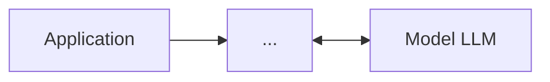
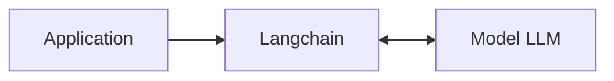

---
# config for the whole slides and the first one
theme: apple-basic

addons:
  - slidev-addon-python-runner
  - slidev-addon-rabbit
rabbit:
  slideNum: true   # Show current/total slide numbers next to a rabbit icon

# some information about your slides (markdown enabled)
title: Langchain Mastery
# author field for exported PDF or PPTX
author: Wahyu Ikbal Maulana
# keywords field for exported PDF, comma-delimited
keywords: keyword1,keyword2

download: false
# filename of the export file
exportFilename: slidev-exported
# export options
# use export CLI options in camelCase format
# Learn more: https://sli.dev/guide/exporting.html
export:
  format: pdf
  timeout: 30000
  dark: false
  withClicks: false
  withToc: false


# class: text-center
# https://sli.dev/features/drawing
drawings:
  persist: false

# slide transition: https://sli.dev/guide/animations.html#slide-transitions
transition: slide-left

# enable MDC Syntax: https://sli.dev/features/mdc
mdc: true

# show line numbers in code blocks
lineNumbers: True

# controls whether texts in slides are selectable
selectable: true

layout: intro
---

# <span style="color: #22c55e">Langchain</span> Workshop !

Langchain Workshop
Programming AI Mastery with Langchain: Basic Guide to Generative AI Development

<div class="flex absolute bottom-10">
  <div class="flex flex-col w-full">
    <span class="font-700 mb-2">
      ©Dentechcorp
    </span>
    <span class="font-700 mt-2">
      presented by Wahyu Ikbal Maulana
    </span>
  </div>
</div>

---
layout: two-cols
---

# Introduce Me 👋

<div class="text-left">

## Experience:
- 💻 **AI Engineer** - KANA Service
- 📚 **Tech Lead** - Techfusion
- 🤖 **ML Engineer** - Gastronomi research
- 📚 **Data Analyst** - KANOTARIA
- 📚 **KORIKA AI Mentorship** - KORIKA

## Certificate
- Data Scientist Associate - Datacamp
- AI Engineer for Data Scientist Associate - Datacamp

</div>

::right::

<div class="flex justify-center items-center h-full">


</div>
---

# Intro to generative AI!

Generative AI enables users to quickly generate new content based on a variety of inputs. Inputs and outputs to these models can include text, images, sounds, animation, 3D models, or other types of data.

## How Does Generative AI Work?

Generative AI models use neural networks to identify the patterns and structures within existing data to generate new and original content.

One of the breakthroughs with generative AI models is the ability to leverage different learning approaches, including unsupervised or semi-supervised learning. This has given organizations the ability to more easily leverage a large amount of unlabeled data to create foundation models.

Examples include GPT-3 and Stable Diffusion. ChatGPT (based on GPT-3) can generate essays from short prompts, while Stable Diffusion can produce photorealistic images from text inputs.

*Source: NVIDIA*

---

# 🤖 Generative AI = use LLM Models

## There's a Gap Between Apps & LLM Models

**Main Problem**
- **Different libraries** for each model (OpenAI, Claude, Gemini, etc)
- **Different chat mechanisms** across providers
- **Different integration methods** with databases & vector stores
- **Different agent system implementations**
- **Complexity of switching** models or providers




**Solution:** AI Frameworks! 🛠️

---
layout: center
---

# AI Framework

<div class="text-xl">

## Popular AI Frameworks:

- **[Langchain](https://python.langchain.com/)** 🐍 - General-purpose, modular
- **[LlamaIndex](https://www.llamaindex.ai/)** 📚 - Data ingestion & RAG specialist  
- **[Crew AI](https://www.crewai.com/)** 👥 - Multi-agent systems
- **[Agno](https://www.agno.ai/)** ⚡ - Lightweight & fast prototyping
- **[Haystack](https://haystack.deepset.ai/)** 🌾 - Search & NLP pipelines

</div> 


---
layout: center
---

# Why Langchain?

<div class="text-xl mt-8">

- [ ] **Complete ecosystem** with LangGraph & LangSmith
- [ ] **Well documented** with comprehensive guides
- [ ] **Top 1 most demanded skill** for 2025

</div>

<div class="mt-8">



</div>
---
layout: center
---

## More...

- Most popular & active generative AI framework
- Large community, lots of references (GitHub, YouTube, courses)
- Supports various models (OpenAI, Cohere, HuggingFace, etc)
- Easy to integrate into production applications (backend, fullstack)

---
layout: center
---

# Core Concepts of Langchain

Understand the main components before starting to code

---
layout: two-cols
---

# Main Components of Langchain
<div class="text-left">

## Components
- Chat model(groq, openai, claude)
- Vector store(postgresql, sqlite, vector)
- Document loader(csv, pdf, txt)
- Retriever(RAG)
- Embeddings(openai, gemini, IBM )
- Prompt
- Text Splitter(RAG) 
- Tools (AI Agents)
- Output parser (Not just markdown)
</div>

::right::

<div class="flex justify-center items-center h-full">


</div>

---
layout: two-cols
---

# Langchain.py

```python
from langchain_groq import ChatGroq

model = ChatGroq(
    model="openai/gpt-oss-20b",
    temperature=0
)

response = model.invoke("Tell me a joke")
print(response.content)

# Why don’t skeletons fight each other?
# They don’t have the guts.
```
::right::

# Langchain.js

<div class= "p-4">

  ```javascript
  import { ChatGroq } from "@langchain/groq";
  
  const model = new ChatGroq(
    model: "openai/gpt-oss-20b"
    );
  
  const response = await model.invoke('Tell me a joke');
  console.log(response.content);
  
  // Why don’t skeletons fight each other?
  // They don’t have the guts.
  ```
</div>


---

# Deployment Overview

<div class="grid grid-cols-2 gap-8">

<div>

**Backend(Best practice)**
- Langchain.js via node.js
- Fastapi
- Flask
- Django REST

**Fullstack**
- Langchain.js on React
- Streamlit
- Chainlit
- Django web

</div>
</div>

---
layout: fact
lineNumbers: false
class: item-left
---

# Let's Build! 🚀

## Get Started:

```bash {}
git clone https://github.com/wahyudesu/langchain-workshop
cd rag
uv venv
.venv\Scripts\activate
uv sync
uv run chainlit run app.py -w
```

<div class="mt-8 text-2xl">
Run <code>app.py</code> and begin!
</div>


---

# Vector Database, Embeddings, Retrieval

<div class="grid grid-cols-2 gap-8">

<div>

## Vector Databases

**Storage for embeddings:**
- **Chroma**: Open-source, easy to use
- **Pinecone**: Managed, scalable
- **Weaviate**: Hybrid search capabilities
- **FAISS**: Facebook AI Similarity Search (free)

**Choose based on:**
- Data scale
- Budget
- Self-hosted vs managed

</div>

<div>

## Embeddings

**Convert text to vectors:**
```python
from langchain.embeddings import OpenAIEmbeddings

embeddings = OpenAIEmbeddings()
vectors = embeddings.embed_documents([
    "Langchain is great",
    "AI is powerful"
])
```

**Alternatives:**
- HuggingFace embeddings (free)
- Cohere embeddings
- Custom embeddings

</div>

</div>

---

##  Vector, Database, Upsert, Embeddings, Retrieval, Query


---

# Retrieval Techniques

<div class="grid grid-cols-2 gap-8">

<div>

## Retrieval Techniques

**Similarity Search:**
- Cosine similarity
- Euclidean distance
- Dot product

**Advanced:**
- MMR (Maximal Marginal Relevance)
- Hybrid search (keyword + semantic)
- Re-ranking

</div>

<div>

## Retrieval Example

```python
# Basic similarity search
retriever = vectorstore.as_retriever(
    search_type="similarity",
    search_kwargs={"k": 5}
)

# MMR for diversity
retriever = vectorstore.as_retriever(
    search_type="mmr",
    search_kwargs={"k": 5, "lambda_mult": 0.5}
)

docs = retriever.get_relevant_documents(query)
```

</div>

</div>

---
layout: cover
---

# Fullstack with Langchain

<div class="grid grid-cols-2 gap-8">

<div>

## Chainlit

**Framework for chat applications:**
- React-based UI
- Built-in chat components
- Easy Langchain integration
- Real-time streaming

```python
import chainlit as cl
from langchain.llms import OpenAI

@cl.on_message
async def main(message: cl.Message):
    llm = OpenAI()
    response = await llm.agenerate([message.content])
    await cl.Message(content=response.generations[0][0].text).send()
```

</div>

<div>

## Streamlit

**Rapid prototyping:**
- Python-only
- Simple UI components
- Great for demos & MVPs
- Easy deployment

```python
import streamlit as st
from langchain.llms import OpenAI

st.title("Langchain Chat")

if "messages" not in st.session_state:
    st.session_state.messages = []

for message in st.session_state.messages:
    with st.chat_message(message["role"]):
        st.markdown(message["content"])

if prompt := st.chat_input("What is up?"):
    llm = OpenAI()
    response = llm(prompt)
    st.session_state.messages.append({"role": "user", "content": prompt})
    st.session_state.messages.append({"role": "assistant", "content": response})
```

</div>

</div>


---
layout: center
---

# Langchain JS via Cloudflare Worker

<div class="grid grid-cols-2 gap-8">

<div>

## Cloudflare Workers Benefits

- **Edge Computing**: Low latency globally
- **Serverless**: No server management
- **Durable Objects**: State management
- **KV Storage**: Key-value database
- **R2**: Object storage

**Perfect for:**
- Real-time chat applications
- Global AI services
- Low-latency RAG

</div>

<div>

## Implementation Example

```javascript
import { OpenAI } from 'langchain/llms/openai';
import { ConversationChain } from 'langchain/chains';
import { BufferMemory } from 'langchain/memory';

export default {
  async fetch(request, env) {
    const llm = new OpenAI({
      openAIApiKey: env.OPENAI_API_KEY,
      temperature: 0.7
    });
    
    const memory = new BufferMemory();
    const chain = new ConversationChain({ llm, memory });
    
    const { message } = await request.json();
    const response = await chain.call({ input: message });
    
    return new Response(JSON.stringify({ response: response.response }));
  }
};
```

</div>

</div>

---
layout: center
---

# Wrapping Up 🎉

## What We Built

- 🔄 **More know about Generative AI** with typed data flow
- 🤖 **Know more about langchain**
- 🎨 **How RAG Chat works** from frustrations
- 📦 **More know about AI development**

---
layout: end
---

# Resources

<div class="text-xl mt-8">

- https://business.udemy.com/resources/top-work-employee-skills-2025/
- https://github.com/wahyudesu/Fastapi-AI-Production-Template
- https://github.com/wahyudesu/langchain-workshop
- https://python.langchain.com/docs/introduction/
</div>
