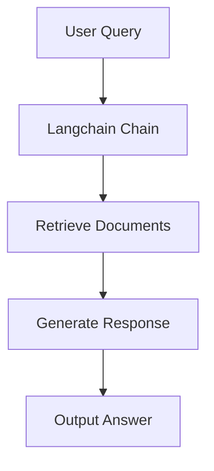
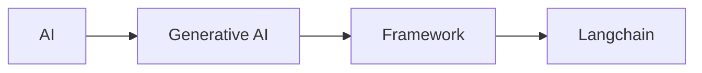

---
# config for the whole slides and the first one
theme: apple-basic

addons:
  - slidev-addon-python-runner
  - slidev-addon-rabbit
rabbit:
  slideNum: true   # Show current/total slide numbers next to a rabbit icon

# some information about your slides (markdown enabled)
title: Langchain Mastery
# author field for exported PDF or PPTX
author: Wahyu Ikbal Maulana
# keywords field for exported PDF, comma-delimited
keywords: keyword1,keyword2

download: false
# filename of the export file
exportFilename: slidev-exported
# export options
# use export CLI options in camelCase format
# Learn more: https://sli.dev/guide/exporting.html
export:
  format: pdf
  timeout: 30000
  dark: false
  withClicks: false
  withToc: false


# class: text-center
# https://sli.dev/features/drawing
drawings:
  persist: false

# slide transition: https://sli.dev/guide/animations.html#slide-transitions
transition: slide-left

# enable MDC Syntax: https://sli.dev/features/mdc
mdc: true

# show line numbers in code blocks
lineNumbers: True

# controls whether texts in slides are selectable
selectable: true

layout: intro
---

# Langchain Workshop !

Langchain Workshop
Programming AI Mastery with Langchain: Basic Guide to Generative AI Development

<div class="flex absolute bottom-10">
  <div class="flex flex-col w-full">
    <span class="font-700 mb-2">
      ©Dentechcorp
    </span>
    <span class="font-700 mt-2">
      presented by Wahyu Ikbal Maulana
    </span>
  </div>
</div>

---
layout: two-cols
---

# Welcome! 👋

<div class="text-xl">

**Today's Mission:**  
Build an AI-powered RAG chatbot using Langchain

Find the materials in the `#langchain-workshop` channel in Slack!

**Format:**
Programming AI Mastery with Langchain: Basic Guide to Generative AI Development

</div>

::right::

<div class="pl-8 pt-8">



</div>

---
layout: center
---

# Introduction

## Apa itu AI Generatif?

<div class="text-xl mt-8">

**AI Generatif** adalah jenis kecerdasan buatan yang dapat menghasilkan konten baru, seperti teks, gambar, musik, atau kode.

**Langchain** adalah framework yang membantu kita membangun aplikasi AI generatif dengan mudah dan terstruktur.

</div>

<div class="mt-8">



</div>
---

# Apa itu Langchain?

---


# Apa itu Langchain?

<div class="grid grid-cols-2 gap-8 pt-4">

<div>

## Framework Generative AI

**Langchain** adalah framework open-source untuk membangun aplikasi AI generatif dengan mudah dan terstruktur.

- � **Ekosistem luas**: Mendukung Python & JavaScript
- � **Komponen modular**: models, data, chain, memory, agent
- � **Integrasi**: API, database, vector store, tools eksternal
- � **Pertumbuhan tercepat**: Salah satu skill AI paling dicari 2025

</div>

<div>

## Kenapa Langchain?

- Framework AI generatif paling populer & aktif
- Komunitas besar, banyak referensi (GitHub, YouTube, kursus)
- Mendukung berbagai model (OpenAI, Cohere, HuggingFace, dsb)
- Mudah diintegrasikan ke aplikasi production (backend, fullstack)

```python
# Contoh chain sederhana
from langchain.llms import OpenAI
from langchain.chains import LLMChain
llm = OpenAI()
chain = LLMChain(llm=llm)
result = chain.run("Apa itu Langchain?")
```

</div>

</div>

---
layout: center
---


---

# Kenapa Langchain?

<div class="grid grid-cols-2 gap-8 pt-4">

<div>

## Alasan Memilih Langchain

- **Top 1 fastest-growing global skills for 2025** (LinkedIn)
- Framework AI generatif paling populer & aktif
- Komunitas besar, banyak referensi (GitHub, YouTube, kursus)
- Mendukung berbagai model (OpenAI, Cohere, HuggingFace, dsb)
- Mudah diintegrasikan ke aplikasi production (backend, fullstack)

</div>

<div>

## Implementasi AI yang Mudah

Langchain memungkinkan kita mengimplementasikan AI generatif dengan:
- **Modular**: Gabungkan komponen sesuai kebutuhan
- **Scalable**: Dari prototype ke production
- **Flexible**: Python & JavaScript support
- **Extensible**: Tambahkan tools & integrations

```python
# Implementasi sederhana
from langchain.llms import OpenAI
llm = OpenAI(temperature=0.7)
response = llm("Jelaskan tentang AI generatif")
```

</div>

</div>

---

# Bandingkan dengan Framework Lain

<div class="grid grid-cols-2 gap-8 pt-4">

<div>

## Langchain vs LlamaIndex

- **Langchain**: General-purpose, lebih fleksibel
- **LlamaIndex**: Spesialis RAG, lebih fokus pada data retrieval
- **Stats**: Langchain memiliki lebih banyak stars di GitHub

</div>

<div>

## Langchain vs AutoGen

- **Langchain**: Framework untuk chains & agents
- **AutoGen**: Fokus pada multi-agent conversations
- **Stats**: Langchain lebih mature & widely adopted

</div>

</div>

---
layout: center
---

# Konsep Inti Langchain

Pahami komponen utama sebelum mulai ngoding

---


# Komponen Utama Langchain

<div class="grid grid-cols-2 gap-8">

<div>

## Komponen-komponen:

- **Models**: Integrasi LLM (OpenAI, Cohere, dsb)
- **Data**: Loader, splitter, retriever, vector db
- **Chain**: Rangkaian proses multi-step (prompt, logic, tools)
- **Memory**: Menyimpan percakapan/riwayat
- **Agent**: AI yang bisa mengambil keputusan & pakai tools

<div class="mt-4 p-2 bg-blue-100 rounded">
Contoh: <br>
- Simple chat (LLM + memory) <br>
- RAG chat (retrieval augmented generation) <br>
- AI agent (tool use, decision making)
</div>

</div>

<div>

```python
# Contoh chain RAG sederhana
from langchain.chains import RetrievalQA
from langchain.vectorstores import FAISS
from langchain.embeddings import OpenAIEmbeddings
db = FAISS.load_local("db", OpenAIEmbeddings())
qa = RetrievalQA.from_chain_type(llm, retriever=db.as_retriever())
qa.run("Apa itu RAG?")
```

</div>

</div>

---

# Basic Langchain via Notebook

<div class="grid grid-cols-2 gap-8">

<div>

## Mulai dengan Notebook

Langchain sangat cocok untuk eksplorasi di Jupyter Notebook:
- Interaktif & mudah debug
- Visualisasi hasil langsung
- Dokumentasi inline

</div>

<div>

```python
# Install langchain
!pip install langchain openai

# Basic setup
import os
os.environ["OPENAI_API_KEY"] = "your-key-here"

from langchain.llms import OpenAI
llm = OpenAI(temperature=0.7)
llm("Hello, world!")
```

</div>

</div>

---

# Simple Chat

<div class="grid grid-cols-2 gap-8">

<div>

## Chat Sederhana dengan Memory

Tambahkan memory untuk percakapan yang berkelanjutan:
- ConversationBufferMemory
- ConversationSummaryMemory
- ConversationBufferWindowMemory

</div>

<div>

```python
from langchain.memory import ConversationBufferMemory
from langchain.chains import ConversationChain

memory = ConversationBufferMemory()
conversation = ConversationChain(
    llm=llm, 
    memory=memory, 
    verbose=True
)

conversation.predict(input="Hi, my name is Wahyu")
conversation.predict(input="What's my name?")
```

</div>

</div>

---

# RAG Chat

<div class="grid grid-cols-2 gap-8">

<div>

## Retrieval Augmented Generation

Gabungkan LLM dengan data eksternal:
- Load dokumen
- Split menjadi chunks
- Buat embeddings
- Simpan di vector database
- Retrieve & generate

</div>

<div>

```python
from langchain.document_loaders import TextLoader
from langchain.text_splitter import CharacterTextSplitter
from langchain.vectorstores import FAISS
from langchain.embeddings import OpenAIEmbeddings

# Load & split
loader = TextLoader("document.txt")
documents = loader.load()
text_splitter = CharacterTextSplitter(chunk_size=1000, chunk_overlap=0)
docs = text_splitter.split_documents(documents)

# Create vectorstore
embeddings = OpenAIEmbeddings()
db = FAISS.from_documents(docs, embeddings)

# Query
query = "What is Langchain?"
docs = db.similarity_search(query)
```

</div>

</div>

---

# AI Agent

<div class="grid grid-cols-2 gap-8">

<div>

## Agent dengan Tools

Agent yang bisa menggunakan tools:
- Tool calling
- Decision making
- Multi-step reasoning
- Integration dengan external APIs

</div>

<div>

```python
from langchain.agents import initialize_agent, AgentType
from langchain.tools import Tool
from langchain.utilities import SerpAPIWrapper

# Define tools
search = SerpAPIWrapper()
tools = [
    Tool(
        name="Search",
        func=search.run,
        description="useful for when you need to answer questions about current events"
    )
]

# Create agent
agent = initialize_agent(
    tools, 
    llm, 
    agent=AgentType.ZERO_SHOT_REACT_DESCRIPTION, 
    verbose=True
)

agent.run("What's the weather in Jakarta?")
```

</div>

</div>

---

# Deployment Overview

<div class="grid grid-cols-2 gap-8">

<div>

## Opsi Deployment Langchain

**Backend (Python/FastAPI):**
- REST API untuk integrasi
- Async support
- Production-ready dengan Docker

**Frontend (JavaScript/React):**
- Langchain.js untuk browser
- Integrasi dengan React/Next.js
- Real-time chat interfaces

**Cloud Platforms:**
- Vercel, Netlify untuk frontend
- Railway, Render untuk backend
- Cloudflare Workers untuk edge computing

</div>

<div>

## Contoh Deployment Backend

```python
from fastapi import FastAPI
from langchain.llms import OpenAI
from langchain.chains import ConversationChain
from langchain.memory import ConversationBufferMemory

app = FastAPI()
llm = OpenAI()
memory = ConversationBufferMemory()
chain = ConversationChain(llm=llm, memory=memory)

@app.post("/chat")
async def chat(message: str):
    response = chain.run(message)
    return {"response": response}
```

</div>

</div>

---

# Building RAG Agent

<div class="grid grid-cols-2 gap-8">

<div>

## Langkah-langkah Build RAG Agent

1. **Load Documents**: Load data dari berbagai sumber
2. **Split Text**: Pecah menjadi chunks yang manageable
3. **Create Embeddings**: Convert ke vector representations
4. **Store in Vector DB**: Simpan di database vektor
5. **Build Retriever**: Sistem untuk retrieve relevant docs
6. **Create Chain**: Gabungkan retriever dengan LLM
7. **Add Memory**: Untuk percakapan yang berkelanjutan

</div>

<div>

## Contoh Implementasi RAG

```python
from langchain.document_loaders import DirectoryLoader
from langchain.text_splitter import RecursiveCharacterTextSplitter
from langchain.vectorstores import Chroma
from langchain.embeddings import OpenAIEmbeddings
from langchain.chains import ConversationalRetrievalChain

# Load documents
loader = DirectoryLoader('./docs', glob="**/*.txt")
docs = loader.load()

# Split text
text_splitter = RecursiveCharacterTextSplitter(
    chunk_size=1000, 
    chunk_overlap=200
)
splits = text_splitter.split_documents(docs)

# Create vectorstore
embeddings = OpenAIEmbeddings()
vectorstore = Chroma.from_documents(splits, embeddings)

# Create chain
qa_chain = ConversationalRetrievalChain.from_llm(
    llm, 
    vectorstore.as_retriever(),
    memory=memory
)
```

</div>

</div>

---

# Vector Database, Embeddings, Retrieval

<div class="grid grid-cols-2 gap-8">

<div>

## Vector Databases

**Penyimpanan untuk embeddings:**
- **Chroma**: Open-source, mudah digunakan
- **Pinecone**: Managed, scalable
- **Weaviate**: Hybrid search capabilities
- **FAISS**: Facebook AI Similarity Search (gratis)

**Pilih berdasarkan:**
- Scale data
- Budget
- Self-hosted vs managed

</div>

<div>

## Embeddings

**Convert text ke vectors:**
```python
from langchain.embeddings import OpenAIEmbeddings

embeddings = OpenAIEmbeddings()
vectors = embeddings.embed_documents([
    "Langchain is great",
    "AI is powerful"
])
```

**Alternatif:**
- HuggingFace embeddings (gratis)
- Cohere embeddings
- Custom embeddings

</div>

</div>

---

# Retrieval Techniques

<div class="grid grid-cols-2 gap-8">

<div>

## Teknik Retrieval

**Similarity Search:**
- Cosine similarity
- Euclidean distance
- Dot product

**Advanced:**
- MMR (Maximal Marginal Relevance)
- Hybrid search (keyword + semantic)
- Re-ranking

</div>

<div>

## Contoh Retrieval

```python
# Basic similarity search
retriever = vectorstore.as_retriever(
    search_type="similarity",
    search_kwargs={"k": 5}
)

# MMR for diversity
retriever = vectorstore.as_retriever(
    search_type="mmr",
    search_kwargs={"k": 5, "lambda_mult": 0.5}
)

docs = retriever.get_relevant_documents(query)
```

</div>

</div>

---
layout: cover
---

# Fullstack dengan Langchain

<div class="grid grid-cols-2 gap-8">

<div>

## Chainlit

**Framework untuk chat applications:**
- React-based UI
- Built-in chat components
- Easy Langchain integration
- Real-time streaming

```python
import chainlit as cl
from langchain.llms import OpenAI

@cl.on_message
async def main(message: cl.Message):
    llm = OpenAI()
    response = await llm.agenerate([message.content])
    await cl.Message(content=response.generations[0][0].text).send()
```

</div>

<div>

## Streamlit

**Rapid prototyping:**
- Python-only
- Simple UI components
- Great for demos & MVPs
- Easy deployment

```python
import streamlit as st
from langchain.llms import OpenAI

st.title("Langchain Chat")

if "messages" not in st.session_state:
    st.session_state.messages = []

for message in st.session_state.messages:
    with st.chat_message(message["role"]):
        st.markdown(message["content"])

if prompt := st.chat_input("What is up?"):
    llm = OpenAI()
    response = llm(prompt)
    st.session_state.messages.append({"role": "user", "content": prompt})
    st.session_state.messages.append({"role": "assistant", "content": response})
```

</div>

</div>


---
layout: center
---

# Langchain JS via Cloudflare Worker

<div class="grid grid-cols-2 gap-8">

<div>

## Keuntungan Cloudflare Workers

- **Edge Computing**: Low latency globally
- **Serverless**: No server management
- **Durable Objects**: State management
- **KV Storage**: Key-value database
- **R2**: Object storage

**Perfect untuk:**
- Real-time chat applications
- Global AI services
- Low-latency RAG

</div>

<div>

## Contoh Implementasi

```javascript
import { OpenAI } from 'langchain/llms/openai';
import { ConversationChain } from 'langchain/chains';
import { BufferMemory } from 'langchain/memory';

export default {
  async fetch(request, env) {
    const llm = new OpenAI({
      openAIApiKey: env.OPENAI_API_KEY,
      temperature: 0.7
    });
    
    const memory = new BufferMemory();
    const chain = new ConversationChain({ llm, memory });
    
    const { message } = await request.json();
    const response = await chain.call({ input: message });
    
    return new Response(JSON.stringify({ response: response.response }));
  }
};
```

</div>

</div>

---

# Workshop Format 📋

<div class="grid grid-cols-2 gap-8">

<div>

## Self-Paced Learning

1. **Clone the repo** and start at `step-0`
2. **Follow WORKSHOP.md** at your own pace
3. **Complete each step** before moving on
4. **Use branch checkpoints** if you fall behind

## Checkpoint Schedule

- **0:20** - Should complete Step 0 (Setup)
- **0:40** - Should complete Step 1 (First workflow)
- **1:00** - Should complete Step 2 (Full workflow)
- **1:20** - Should complete Step 3 (Agent)
- **1:40** - Should complete Step 4 (Polish)

</div>

<div>

## Getting Unstuck

### If you fall behind:
```bash
git checkout steps/step-2
npm install
```

### If you need help:
- 🙋 Raise your hand
- 💬 Ask in chat
- 👀 Check the solution branch

### Remember:
- **Quality > Speed**
- **Understanding > Completion**
- **It's OK to explore!**

</div>

</div>

---
layout: fact
---

# Let's Build! 🚀

## Get Started:

### `#workshop-ai-agents-with-mastra`

```bash
git clone git@github.com:workos/mastra-agents-meme-generator.git
cd mastra-agents-meme-generator
git checkout steps/step-0
npm install
```

<div class="mt-8 text-2xl">
Open <code>WORKSHOP.md</code> and begin!
</div>

---

# Checkpoint: Step 0 ✅
### Time: 0:20

<div class="text-xl">

You should have:
- ✅ Project cloned and dependencies installed
- ✅ `.env` file with your OpenAI API key
- ✅ Mastra playground running at `http://localhost:4111`
- ✅ Understanding of the project structure

### Trouble? 
```bash
git checkout steps/step-1
npm install
```

</div>

---

# Checkpoint: Step 1 ✅
### Time: 0:40

<div class="text-xl">

You should have:
- ✅ Created frustrations schema with Zod
- ✅ Built your first workflow step
- ✅ Tested extraction in the playground
- ✅ Seen structured data from AI

### Trouble?
```bash
git checkout steps/step-2
npm install
```

</div>

---

# Checkpoint: Step 2 ✅
### Time: 1:00

<div class="text-xl">

You should have:
- ✅ All workflow steps created
- ✅ Steps chained together with data mapping
- ✅ Successfully generated a meme!
- ✅ Understanding of workflow composition

### Trouble?
```bash
git checkout steps/step-3
npm install
```

</div>

---

# Checkpoint: Step 3 ✅
### Time: 1:20

<div class="text-xl">

You should have:
- ✅ Created the meme generator agent
- ✅ Agent responding conversationally
- ✅ Automatic workflow triggering
- ✅ Memory persistence working

### Trouble?
```bash
git checkout steps/step-4
npm install
```

</div>

---
layout: center
---

# Wrapping Up 🎉

## What We Built

- 🔄 **Multi-step workflow** with typed data flow
- 🤖 **Conversational agent** with memory
- 🎨 **Real meme generation** from frustrations
- 📦 **Production patterns** for AI apps

---

# Key Takeaways 💡

<div class="grid grid-cols-2 gap-8">

<div>

## Technical Learnings

- **Workflows** compose complex AI operations
- **Agents** add state and decision-making
- **Type safety** catches errors early
- **Structured generation** ensures reliable output

## Mastra Benefits

- 🏗️ **Framework, not boilerplate**
- 🔒 **Type-safe by default**
- 🔍 **Observable and debuggable**
- 🚀 **Production-ready patterns**

</div>

<div>

## What's Next?

### With Your Meme Generator:
- Add more meme sources
- Implement meme history
- Add user preferences
- Deploy to production

### With Mastra:
- Explore tool creation
- Build multi-agent systems
- Add vector databases
- Implement RAG patterns

</div>

</div>

---
layout: center
---


# [mcp.shop](https://mcp.shop)

---
layout: center
---

# Thank You! 🙏

<div class="text-xl">

## Resources

- 📚 **Docs**: [mastra.ai/docs](https://mastra.ai/docs)
- 💻 **GitHub**: [https://github.com/mastra-ai/mastra](https://github.com/mastra-ai/mastra)

## Your Feedback Matters!

Please fill out our workshop survey: [link-to-survey]

</div>

---
layout: end
---

# Questions?

<div class="text-xl mt-8">

Let's discuss:
- Implementation details
- Architecture decisions  
- Production considerations
- What you'd build next

</div>